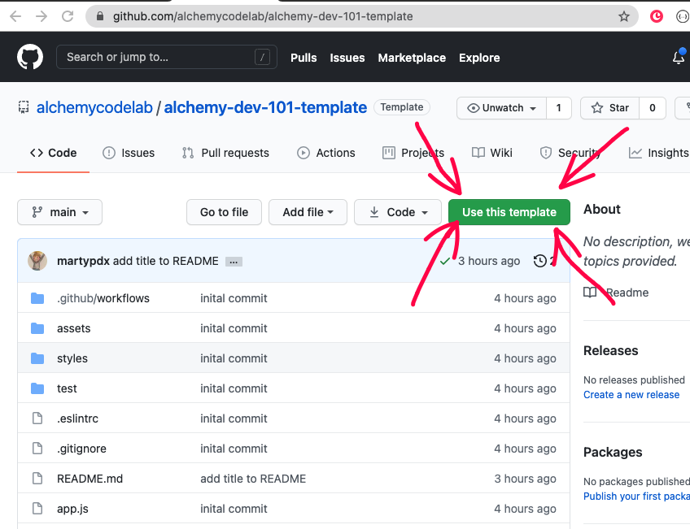

# Bonus Lab: Magic Eight Ball

## Goal

Make a magic eightball style app where the user asks a questions and a random answer appears!

## Standard Setup Process

### Create Repo from Template

Use the [alchemy dev-101 template](https://github.com/alchemycodelab/alchemy-dev-101-template) to create a new repo called `lab-03-calculator` on Github


### Turn on GitHub Pages

In the Settings tab, then pages side tab:

1. Choose `main` branch and use the default /(root) setting
1. Click "Save"
1. Copy the link to the published site
1. Go back to the main repo page and click the settings wheel by "About" and paste in the link

### Clone the Repo Locally

1. Copy the URL of the new repo
1. From the command line (terminal) clone your repo:
1. Check with `pwd` that you are in correct directory for labs
1. `git clone <url>`
1. **`cd` into your repo from the command line**
1. Launch vscode with `code .`

## Design

You can take this in a lot of directions, find images online. Change the theme etc.

You can add an `<audio>` tag that auto plays and loops. (Search "Audio element")

You can use the [classic eight-ball answers](https://en.wikipedia.org/wiki/Magic_8-Ball) or come up with your own.

## Technical Design and Guidance

Give the user a `<textarea>` and a `<button>` (but it doesn't matter what they type in the box). Add an element that will hold the answer.

Create a file `answers.js` and export an array that has all the possible answers:

```js
export const answers = [
    `It is Certain.`,
    `Reply hazy, try again.`,
    `Don't count on it.`,
    // etc.
]
```

Look up `Math.rnd` on MDN and find a way to generate a random number between `0` and the `answers.length - 1`. You can put this function in `app.js`

In `app.js`, add a click event handler to the `<button>` and when clicked:
1. Generate a random number.
2. Use that random number to access the element of the array.
3. Set the text content of the answer element to that value.

```js
const randomIndex = getRandomNumber(0, answers.length);
const randomAnswer = answers[randomIndex];
answerDisplay.textContent = randomAnswer;
```