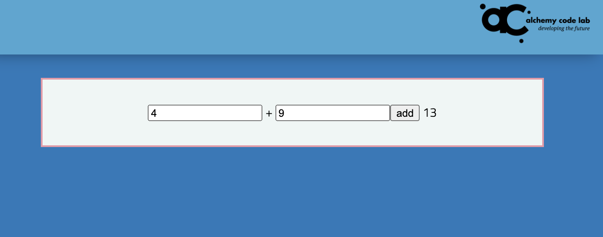
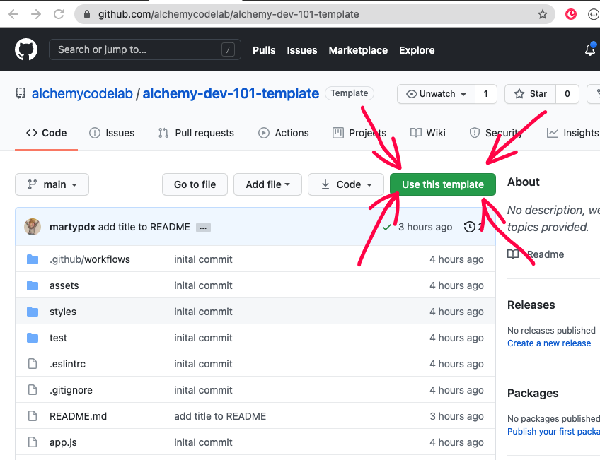
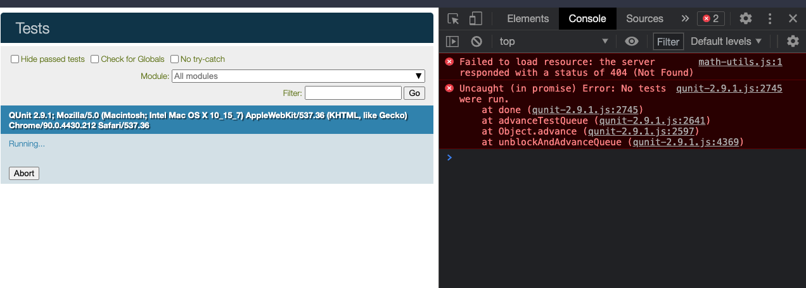
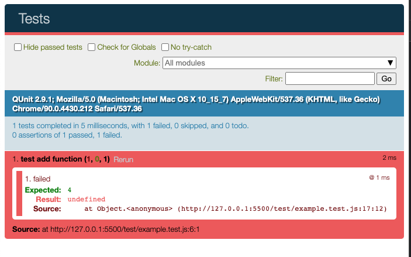

# Lab 04: Let's build a calculator!

## Goal

There should be two inputs and one button for every operation. For the case of the add feature, when the user enters numbers into the addition inputs, then clicks the button, the sum should appear in the div.

It might look a little like this:


## Standard Setup Process

### Create Repo from Template

Use the [alchemy dev-101 template](https://github.com/alchemycodelab/alchemy-dev-101-template) to create a new repo called `lab-03-calculator` on Github


### Turn on GitHub Pages

In the Settings tab, then pages side tab:

1. Choose `main` branch and use the default /(root) setting
1. Click "Save"
1. Copy the link to the published site
1. Go back to the main repo page and click the settings wheel by "About" and paste in the link

### Clone the Repo Locally

1. Copy the URL of the new repo
1. From the command line (terminal) clone your repo:
1. Check with `pwd` that you are in correct directory for labs
1. `git clone <url>`
1. **`cd` into your repo from the command line**
1. Launch vscode with `code .`

## Technical Design

Your HTML and CSS work will occur in two files:

| file                | purpose                                                         |
| ------------------- | --------------------------------------------------------------- |
| `index.html`        | web page with HTML elements                                     |
| `styles/styles.css` | css layout and styling for the calculator                       |
| `styles/reset.css`  | you won't work here, but this resets the default browser styles |

Your JavaScript work will occur in three files:

| file              | purpose                                   | imports                                 |
| ----------------- | ----------------------------------------- | --------------------------------------- |
| `app.js`          | main entry point and app logic            | math functions from `./calculations.js` |
| `calculations.js` | exports functions for doing maths         | none                                    |
| `test/tests.js`   | unit tests that prove math functions work | math functions from `./calculations.js` |

## Step by Step Guide to Each Calculator Feature

We will build this vertically, meaning we will deliver full functionality for each math operation before moving to the next feature.

### UI Setup with Event Listener

#### Generate UI

HTML and CSS which should include two inputs and a button to click and place to put the result

-   Your inputs and buttons will need ids.
-   You will need a span to put the answers into. The span will need an id.
    **_Validation step_**: look at the UI and also at the ids in the Elements tab in the browser

**_ACP your code with commit message "Created UI for add" and push it to your main branch!_**

#### JavaScript to Wire Up Event

Write the JavaScript in `app.js`:

-   Reference the DOM elements needed for that feature
    **_Validation step_**: `console.log` the four referenced DOM elements to make sure id's matched
-   Subscribe to the button click and `console.log` a message like "Add button clicked"
    **_Validation step_**: Click the button and make sure the message appears

**_ACP your code with commit message "Added add UI and button listener" and push it to your main branch!_**

### TDD Calc Function

#### Write a Failing Test

1. Create a new test (for the first operation you can replace the example test). Use the example below as a template:

    ```js
    import { add } from '../calculations.js';

    const test = QUnit.test;

    test('add function', (expect) => {
        //Arrange
        // Set up your arguments and expectations
        const expected = 5;

        //Act
        // Call the function you're testing and set the result to a const
        const actual = add(2, 3);

        //Expect
        // Make assertions about what is expected versus the actual result
        expect.equal(actual, expected);
    });
    ```

1. (First operation only)
    1. Launch your code using LiveServer and navigate to `http://127.0.0.1:5500/test/`.
    1. You should see an error in your console because it cannot find `calculations.js` -- we'll fix that next!
        <!-- prettier-ignore -->
        <p align="center">
            
        </p>
    1. Create the `calculations.js` file
1. Export an empty `add` function (or whatever operation you are working on) from `calculations.js`. You should now get a more useful testing error!

    ```js
    export function add(x, y) {}
    ```

    <p align="center">
        
    </p>

    **_ACP your code with commit message "Failing test for add function" and push it to your main branch!_**

#### Passing Test

Now write the code in the function to make the test pass!

**_ACP your code with commit message "TDD for add function" and push it to your main branch!_**

### Import and Use Math Function

Use your function to calculate the result in `app.js`:

1. `import` the function into `app.js`

    **Validation step**: Log out the imported function

1. In your event listener, convert the input values to a number using the `Number` function

    **Validation step**: Log out the converted values of the two inputs inside your event listener

1. Use your function to calculate a result and store in a variable

    **Validation step**: Log out the result value

1. Assign the result to `.textContent =` of the element that will hold the result

    **Validation step**: Manually tests that it works

**_ACP your code with commit message "Working add feature" and push it to your main branch!_**

## Rinse and repeat...

Repeat all of these steps for all four operations! STRETCH: bonus operations

## Points Break Down

| Looking For                                                                                                                                 | Points (10) |
| :------------------------------------------------------------------------------------------------------------------------------------------ | ----------: |
| Nicely styled text input and styled buttons                                                                                                 |           2 |
| Fully functional and tested **add** function deployed on Github pages                                                                       |           2 |
| Fully functional and tested **subtract** function deployed on Github pages                                                                  |           2 |
| Fully functional and tested **multiply** function deployed on Github pages                                                                  |           2 |
| Fully functional and tested **divide** function deployed on Github pages                                                                    |           2 |
| STRETCH: Add [modulo function](https://en.wikipedia.org/wiki/Modulo_operation)                                                              |          +1 |
| STRETCH: Add [integer division](https://mathworld.wolfram.com/IntegerDivision.html)                                                         |          +1 |
| STRETCH: Calculate the length of a right triangle hypotenuse using [pythagorean theorem](https://en.wikipedia.org/wiki/Pythagorean_theorem) |          +1 |
| STRETCH: Add any other math functions you can think of!                                                                                     |          +1 |
