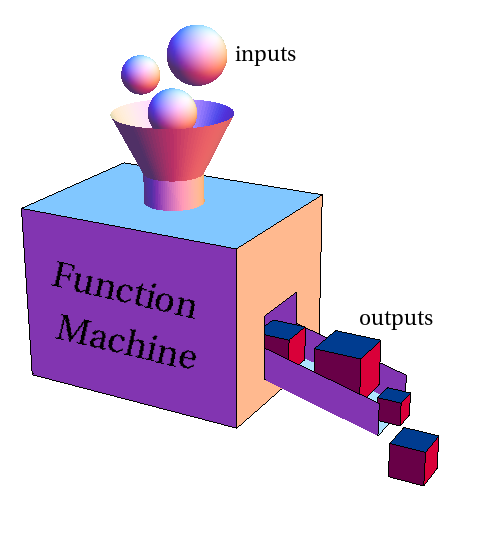

Functions: Saving code for later/sharing behavior
===


## Loose coupling

Loosely coupled systems are like cars: you can easily replace parts without taking apart the whole thing!

When we break our work into functions, we can replace pieces without having to change the base app.

## Pure functions

If a function is like a machine that takes input, and (predictably) returns the same output every time it is run, it is called pure function.

A mechanical juicer is a good metaphor for a pure function. If I feed it the same fruits and vegetables every time, I will always get exactly the same delicious output: juice!

Similarly, `add(3, 4)` is a pure function. We expect to get the same output (`7`) whenever we pass the same input (`3, 4`)

To illustrate this idea, here is a drawing of profound beauty and grace:



## Input and Output

In functions, `input` is called `arguments` or `parameters`.

There are two stages of a function: `declaration` and `calling`. 
- When I `declare` a function, I am building the juicer or writing a recipe for bread. 
- When I `call` a function, I am shoving fruits and vegetables (`arguments`) into the juicer (`function`) in order to create some juice (`output`). Or I'm baking the bread.

```js
function makeHelloString(name) {
    return 'Hello, ' + name + '!'
}

makeHelloString('kati') // 'Hello kati!'

// return value can be stored in a const to be used later

const greeting = makeHelloString('kati')

// let's use the variable we made!
alert(greeting);
```

## Impure functions

Imput functions are functions with no input or output, or functions where the output is not predictable. Anything that depends on the current date, or a random number, or the user's favorite food, or anything else _outside the machine and not supplied as an argument_ counts as an impure function.

Impure functions are hard to test.

```js
function launchAlertWithCurrentTime() {
    alert(new Date());
}
```
