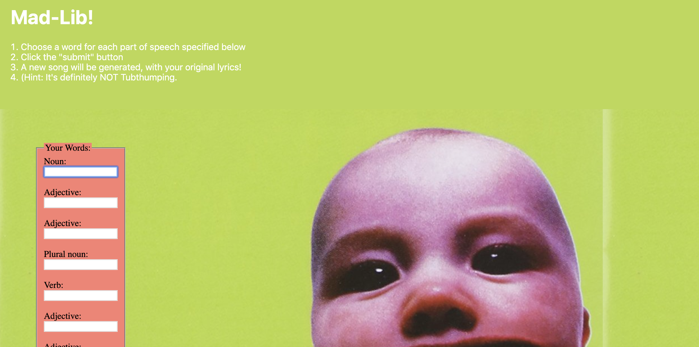

MadLib Challenge
===

Create a web page that allows the user to play a MadLib game!

## Group Work

Work in a mob on this project, with one person driving and everybody else navigating while looking at the shared code. Navigators can research, but _cannot under any circumstances be writing code_. (If you do, you will likely have merge issues and git will tell on you).

You **must** use a 20 minute timer. Google: https://www.google.com/search?q=pomadoro+timer to find a timer.

1. Pick one person should make a repo:
    1. Use the [alchemy dev-101 template](https://github.com/alchemycodelab/alchemy-dev-101-template) to create a new repo called `PROJECT-madlib-challenge` on Github
    1. Then give everybody permission to work on it. 
        1. Settings > Manage Access
        1. "Invite Teams or People"
        1. Enter GitHub User name(s)
    1. Turn on GitHub Pages
        1. Choose `main` branch and use the default /(root) setting
        1. Click "Save"
        1. Copy the link to the published site
        1. Go back to the main repo page and click the settings wheel by "About" and paste in the link
1. Everybody should clone this repo
    1. Copy the URL of the new repo
    1. From the command line (terminal) clone your repo:
    1. Check with `pwd` that you are in correct directory for labs
    1. `git clone <url>`
    1. **`cd` into your repo from the command line**
    1. Launch vscode with `code .`
1. Pick first person to drive, while everybody else "navigates" by contributing verbally. Then every 20 minutes, that person will push their code, and everybody else will pull, and you will pick a new driver.
    - When it's time for you to "drive", you can `git pull origin main` (or just `git pull` or click the sync button lower left of VS Code) in your cloned version of the repo to get the freshest code. 
    - When it's time for you to pass off to the next person, add, commit, and `git push` (or just `git push` or click the sync button lower left of VS Code) so they can pull to get the freshest code.
    - No harm in gratuitously running `git pull origin main`. The more often you do this, the easier everything will be!
1. If you are faithfully following the process, you will not have merge issues. If you do, seek help.

## STRETCH GOAL: Advanced group work

1. In addition to all of the above (don't skip pulling fresh code), when you become driver, you make a branch off of main. Using your name for the branch is fine for now: `git checkout -b martys-branch`.
1. Make sure you have all the freshest code by using `git pull origin main` while on your new branch.
1. You can see what branch you're on at any time by using `git status`
1. When it's time to push your code and swap off (ACP), you will
    1.  use `git push -u origin martys-branch`.
    1. Then you will go to the repo in github and see the yellow div with a green button that says "Compare and Pull Request". This will make a pull request.
    1. Review the code changes as a group, make sure all checks pass (eslint). If there are issues, the driver can correct and push up the changes.
    1. Then someone can merge the code with this pull request.
    1. Don't forget to `git pull` after the PR is merged before starting the new driver

## Design MadLib

Come up with a few short paragraphs and pick some key words for which the user will provide values. You can use a famous poem or song, or a news headline, or make something up.

**Timebox this part to no more than ~15 minutes!**

Use ``'s for "blanks" where the words will be inserted and give each one an `id`. Keep in mind each span needs a unique `id`, so you might sequentially number them like `noun-1`, `noun-2`. 

Read your html code and improve.

Time for a commit!

Style the page and the story, maybe find some fun images! 

**Timebox this part to no more than ~40 minutes!**

Time for a commit!

## Prompt for Words

Provide labels and inputs for the user. Describe the grammar you want them to provide (noun, verb, adjective, etc). Keep in mind each input needs a unique `id`, so you might sequentially number them like `noun-1-input`, `noun-2-input`.

It's very helpful to have a consistent pattern:

`` id |`<input>` id
---|---
`noun-1` | `noun-1-input`
`adjective-1` | `adjective-1-input`
`adjective-2` | `adjective-2-input`
`verb-1` | `verb-1-input`
`noun-2` | `noun-2-input`
`verb-2` | `verb-2-input`

Also provide a button for them to click when it is time to make the MadLib. 

Read your html code and make any needed improvements.

Time for a commit!

## Make MadLib

1. In your JavaScript `app.js`, make variables for all the DOM elements you will
to read data from (input form controls) or write data to (text spans).
2. Add a function, then add an event listener attribute to the button that calls the function. Validate that the function is running when the button is clicked.
3. Write JavaScript logic in your function that mediates data between the inputs and the spans. Validate that it works.
4. Read your code and make it as well crafted as you possibly can.

Read your JavaScript code and make any needed improvements.

Time for a commit!

## Reveal MadLib

Your MadLib is working, but part of the fun is not knowing what the story is. Find the containing element for your story and:
1. Create a CSS class (like `.hidden`) to hide the story (see [docs on controling `display`](https://developer.mozilla.org/en-US/docs/Web/CSS/display))
1. Add that class and an `id` attribute to the containing element.
1. Reference the element in your JavaScript
1. In your function, add a line to remove the hidden class from the element. See if you can figure out how to do that based on [the docs](https://developer.mozilla.org/en-US/docs/Web/API/Element/classList). Feel free to discuss and share with classmates!
1. Validate that it works

Read your JavaScript code and make any needed improvements.

Time for a commit!

## Show the World

1. Push to GitHub
1. Turn on GitHub pages so everyone can play your MadLib game!

## Points Break Down

Looking For | Points (10)
:--|--:
Deployed on GitHub pages, with link in the About section of the Github repo | 2
Nice styling and semantic HTML | 2
Inputs (with ids) and Spans (with corresponding ids) for each word that will be replaced in Mad Lib | 2
On clicking the submit button, show the Mad Lib text (initially hidden) | 2
On clicking the submit button, replace ``s with the correct words from text inputs | 2
