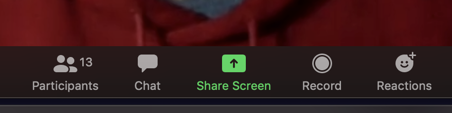
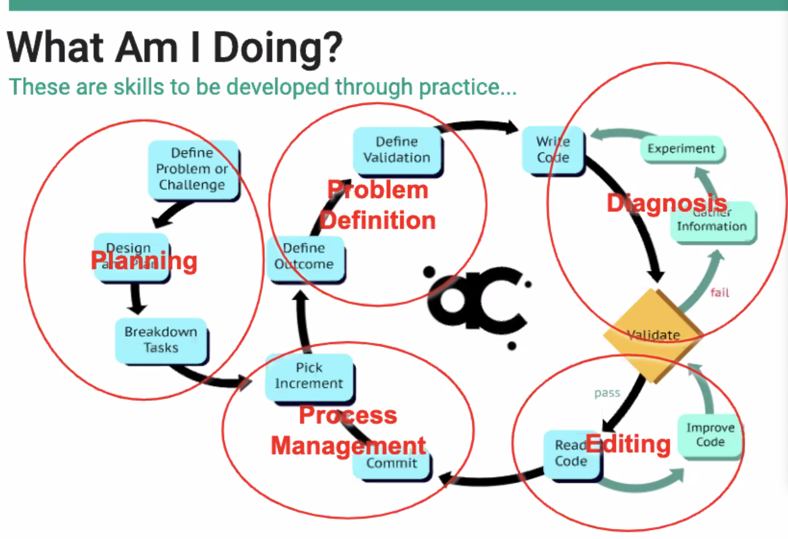

# Foundation Prep: On the Job Training!

##  First things first: screen share

## Our tools
- VSCode with ESLint
  - basically, Microsoft Word with spell check for code
- Git/Github
  - version control
  - 'facebook for code'
- The Browser
  - Chrome, please! 
  - [64% of web users are on Chrome, so that's our target browser](https://gs.statcounter.com/)
- Terminal, Git/Bash, or WSL (Ubuntu on Windows)
  - For Windows users, WSL is a way to run an actual Linux distribution. However (since it's Linux) it has weird, difficult edges anyway, let alone on Windows. If WSL is causing you a lot of problems, download Git/Bash for easy mode.

# Schedule
## Monday: Learning the tools
- Terminal
- Github and git
- VS Code
- Markdown

## Tuesday: Making a Website
 - Making Web apps in VS Code
 - Web Pages
 - Semantic HTML
 - HTML Attributes 
 - CSS Basics (selectors and styles)
 - Flexbox and Grid
 - Simple CSS Animations

## Wednesday: Putting it all Together!
 - JS basics
 - The DOM 
 - Events and Form Controls
 - Interactive Name Tag
 - Audio and Video
 - Animal Farm App

## Thursday: From Hobbyist to Professional
  - Declaring vs Calling functions
  - Testing Code with QUnit
  - Calculator App
  - STRETCH: Arrays and Magic Eight Ball

## Friday: What's it like on the job?
  - Alumni Panel
  - Agile Practices vs Waterfall
  - Mad Libs Mob

---

### Welcome to Foundations Prep! We're going to spend five days giving you
practical "how-to" training on getting setup and using your tools like a
professional developer. 

This will include:
1. The terminal window (command line) 
1. Using Github and git to manage code
1. Integrated Development Environment (IDE)
1. Working with HTML and CSS
1. Working with JavaScript
1. Integrating JavaScript with HTML and CSS
1. Using Agile methodologies to plan and develop software

By the end of this week you'll have leveled up your development skills!

---

## Get help

Post in our Slack Channel

## Resources
* [Mastering Markdown](https://guides.github.com/features/maining-markdown/)
* Keyboard Shortcuts
  * [Mac](http://www.danrodney.com/mac/)
  * [Windows](http://www.hongkiat.com/blog/100-keyboard-shortcuts-windows/)
* Visual Studio Code
  * [The Basics of Visual Studio Code](https://code.visualstudio.com/Docs/editor/codebasics)
  * [VS Code Key Bindings](http://www.hongkiat.com/blog/key-binding-management-visual-studio-code/)
* Bash
  * [Easy Bash PS1 Prompt Generator](https://ezprompt.net)
* Git
  * [Git Documentation](https://git-scm.com/docs)
  * [Git Cheat Sheet](https://www.git-tower.com/blog/git-cheat-sheet/)
  * [How to Write a Git Commit Message](http://chris.beams.io/posts/git-commit/)
