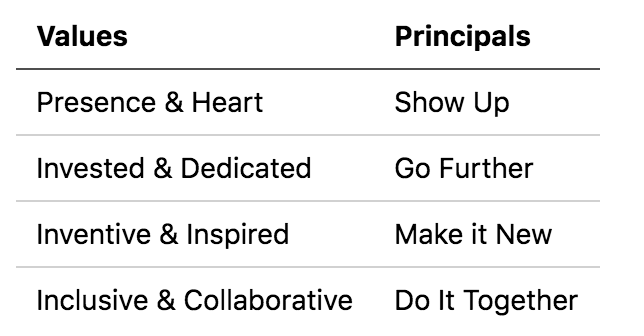

Next Steps!
===

## Review Project Structure

Your project contains the basic elements.

## Ready for Foundations!

### Technically

Complete pre-work, familiarity helps!

Online videos and tutorial resources:

* LinkedIn Learning [Web Development](https://www.linkedin.com/learning/topics/web-development) - Lot's of videos with verbal explanations of key parts of web development
* [Khan Academy](https://www.khanacademy.org/computing/computer-programming)
* [Free Code Camp](https://www.freecodecamp.org/)

Code challenges (easy problems available!):

* [Code Wars](https://www.codewars.com/)
* [Edabit](https://edabit.com/)
* [Exercism](https://exercism.io/) - Relaunching v3 on Sept 1
* [Project Euler .net](https://projecteuler.net/)

### Mindset

Growth Mindset is critical!

Resources:
* https://www.brainpickings.org/2014/01/29/carol-dweck-mindset/
* https://www.atlassian.com/blog/inside-atlassian/growth-mindset

1. It will feel very challenging
1. Develop positive responses!
1. Alternative is to engage a story of misery directed at:
    1. Yourself
    1. Us

### How Can You Improve?

* Technical knowledge is fleeting
* Good habits are invaluable
* Bad habits are hard to lose

This is a craft. Process is critical. Where can you improve?

1. Attention to Detail
1. Focus Shifting
1. Read Code
1. Ownership
1. Listen to the System
1. Do the Work
1. Invest in Yourself

### Alchemy Values and Principals



### Empowering Question

```
What would have to happen for me to __________________?
                                     hard thing to do
```